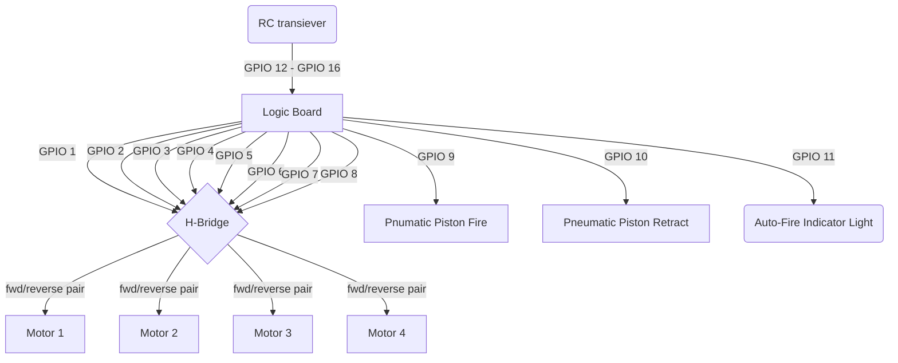

# battlebot-sw
Firmware for Isomatter::Labs battlebot
submitted to the 2024 Battlebots competition
in the ant-weight division.

## Building Instructions
To build, run:
`zig build`, and flash the resulting `zig-out/bin/firmware.uf2` file
to the RP2040 using the UF2 interface.

## Wiring

